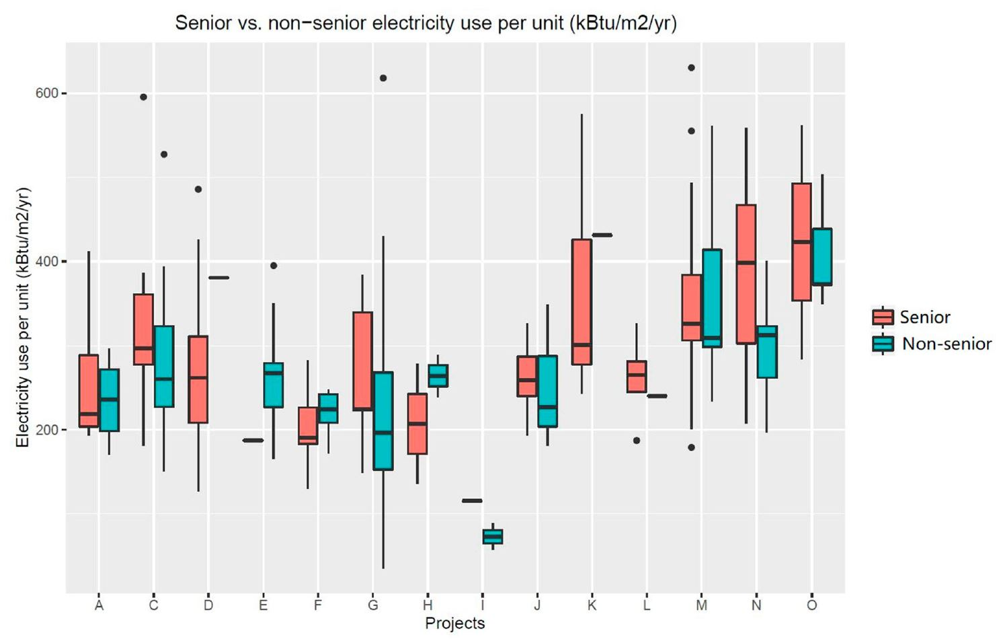
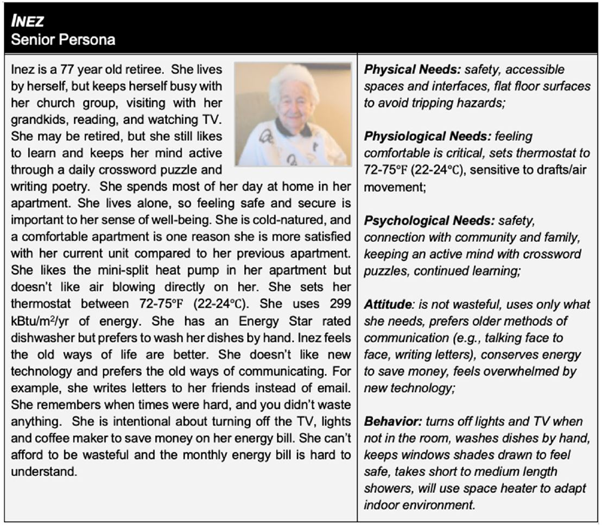
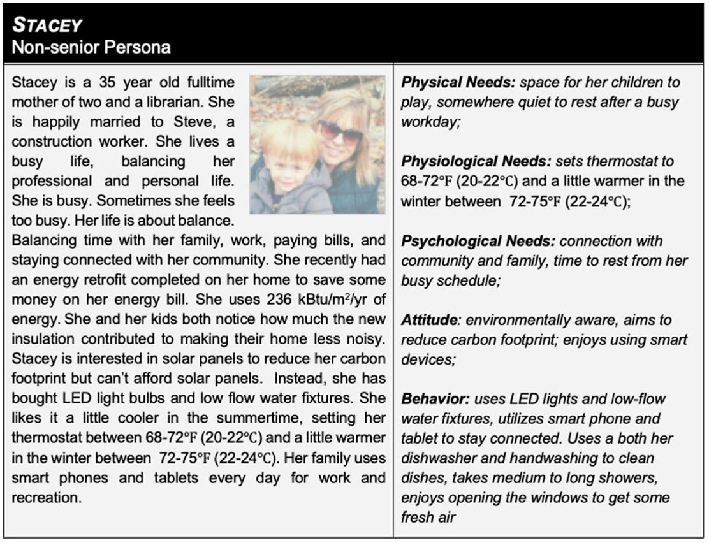

# Data-Driven Building Occupant Profile (Persona) Development

Smart buildings are intricate systems, yet professionals in the architecture, engineering, and construction (AEC) fields often conduct their tasks without considering the human aspects of the building occupants. The AEC industry has traditionally used a straightforward design and delivery method. However, as buildings become more intelligent, it's vital that the AEC industry evolves. To enhance the well-being of humans and the operational efficiency of smart buildings, an iterative, people-focused approach needs to be adopted. Ignoring human elements in the planning and implementation of smart building systems may result in a disconnect between what building users need and the AEC industry's understanding of those needs.

[Dr. Philip Agee](https://www.bc.vt.edu/people/agee) and [Dr. Ray Gao](http://www.raygaoai.com/) (Xinghua Gao) at Virginia Polytechnic Institute and State University (Virginia Tech) propose a human-centred approach to smart housing: developing data-driven Personas that communicate smart housing user needs. There are two research studies in this project. The first study led by Dr. Agee utilized data gathered from 309 high-efficiency residential units across the United States. The main sources of data were long-term energy usage records, resident surveys, and semi-structured interviews. Affinity diagramming was used to classify the qualitative information. The outcome of the affinity diagramming and energy examination facilitated the creation of data-backed Personas that convey the needs of smart housing users. The published research article can be found [here](papers/2021_smart_housing.pdf).

The second study led by Dr. Gao proposes a machine learning-driven methodology for classifying and predicting occupant attributes, aiming to streamline the process of creating building occupant personas. The study scrutinizes the 2015 Residential Energy Consumption Dataset using six machine learning techniques—Linear Discriminant Analysis, K Nearest Neighbors, Random Forest (Decision Tree), Support Vector Machine, and AdaBoost classifier. These techniques are used to predict 16 different occupant attributes such as age, education, and thermal comfort. The models yielded decent accuracy in predicting most occupant traits, and exceptionally high accuracy (over 90%) for features including household occupancy, age group, and preference in the usage of primary cooling equipment. The findings demonstrate the potential of employing machine learning techniques for predicting occupant attributes and facilitating the automated development of building occupant personas, thereby reducing human intervention. The research article can be found [here](papers/2023_ML_persona.pdf). The source code is developed by Ph.D. student [Sheik Murad Hassan Anik](https://www.linkedin.com/in/anik801/), who is co-advised by [Dr. Na Meng](https://people.cs.vt.edu/nm8247/) and Dr. Gao. The repository can be found [here](https://github.com/anik801/ML_RECS).

Dr. Gao’s work in this project is under an umbrella research program [Internet of Things Enabled Data Acquisition Framework for Smart Building Applications](https://github.com/XinghuaGao/IoT-building-data#internet-of-things-enabled-data-acquisition-framework-for-smart-building-applications), which is initiated by Dr. Gao.

## Developing Building Occupant Personas

The team used an online benchmarking software, WegoWise, to gather electricity data at the apartment level on a monthly schedule from May 2013 to April 2018. The sample encompassed 309 sub-metered residential units across 20 developments in Virginia. These units varied from one to four-bedroom apartments. We supplemented Energy Efficiency and Conservation (EEC) data with architectural specifics like conditioned floor areas (in square meters), window-wall ratios, unit locations (for example, end unit, interior unit), and unit technologies, including heating, ventilation, and cooling equipment. These details were sourced from the construction documents provided by the participating developers, and their accuracy was confirmed through site visits.

Energy usage data were regularized by the site's energy use intensity (EUI), allowing us to calculate the annual energy consumption in kilo British thermal units per square meter (kBtu/m2) for each unit in the sample. We employed R scripts for the descriptive statistics and energy analysis, with a specific focus on the variability between the energy use of seniors and non-seniors. A mean EUI was determined for both senior and non-senior samples and was used as input for persona development.

After conducting energy analysis, behavioral analysis, semi-structured interviews, and affinity diagramming, the authors combined the findings to create a senior persona and a non-senior persona.

For the machine learning-enabled approach for user persona generation (the second study), please see [this repository](https://github.com/anik801/ML_RECS).

## Source Code and Data

This repository serves as the index for the related research results and source code.

[code/visual.R](code/visual.R) is the script for data cleaning, analysis, and visualization of [the first study](papers/2021_smart_housing.pdf). 

The dataset used in this research can be found [here](https://osf.io/ur8th/) in OSF.io.

## Project Team and Contributors

[Dr. Ray Gao](http://www.raygaoai.com/)

[Dr. Philip Agee](https://www.bc.vt.edu/people/agee)

[Sheik Murad Hassan Anik (soon to be PhD)](https://www.linkedin.com/in/anik801/)

[Dr. Na Meng](https://people.cs.vt.edu/nm8247/)

[Dr. Andrew McCoy](https://www.bc.vt.edu/people/mccoy)

[Dr. Frederick Paige](https://cee.vt.edu/people/faculty/paige.html)

[Dr. Brian Kleiner](https://www.ise.vt.edu/people/faculty/kleiner.html)
